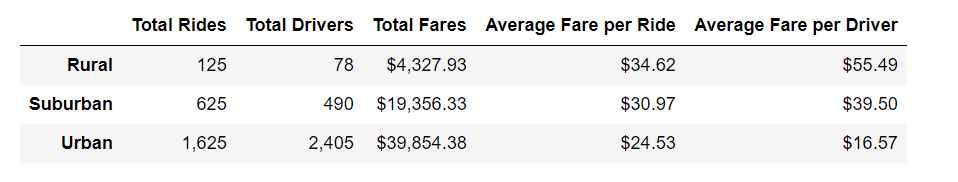

# PyBer_Analysis

## Overview of the analysis:

V. Isualize would like us to create a summary DataFrame of the ride-sharing data by city type and a multiple-line graph that shows the total weekly fares for each city type. BY conducting the analysis, we would like to summarize how the data differs by city type and get some conclusions on how those differences can be used by decision-makers at PyBer.

## Results:

According to the summary dataframe shown above, we gathered some differences in ride-sharing data among the different city types:

1)Total rides: The number of total rides in urban cities is 13 times and twice of those in the rural cities and suburban cities, indicating that urban city has the largest demand in ride sharing and it almost dominates the demand for the entire market. (greater than 68%)

2)Total drivers: The number of total drivers in urban cities is more than 30 times and around 5 times of those in the rural cities and suburban cities, indicating that urban city has excessive supply in ride sharing compared to the other two city types. 

3)Total fares: The total revenue generated from ride sharing in urban cities is around 9 times and around twice of those in the rural cities and suburban cities, indicating that the ride sharing market in urban city does not necessarily make much more revenue compared to the big gap in demand between it and rural cities.

4)Average fare per ride: The average fare per ride is the highest for rural cities, and it is around 40% and 12% higher than those in urban cities and suburban cities respectively.

5)Average fare per driver: The average fare per driver is the highest for rural cities, and it is 3.3 times and 1.4 times of those in urban cities and suburban cities repectively.

6)Total fare by city type: 

According the 

## Summary:
There are three business recommendations to the CEO for addressing any disparities among the city types:
1) As it seems that rural city still has a huge potential in the market demand, Pyber should focus on the marketing in rural cities. Because currently the price per share for rual cities is the highest, a good idea would be to give out promotional price to attract first-time users to expand to market. 
2) The number of drivers in rural cities is way lower than those in the other two city types, which drive the average fare per driver up by a great portion. While trying to expand the market demand in rural cities, Pyber should use the high earnings as an advantage to attract and recruit more drivers. 
3) The number of drivers in suburban cities is also considered low compared to its market demand. As we can see that, the average fare per driver for suburban city is more than twice of it in urban city. Pyber could do the same thing with suburban city, which is to take the advantage and attract more drivers.
